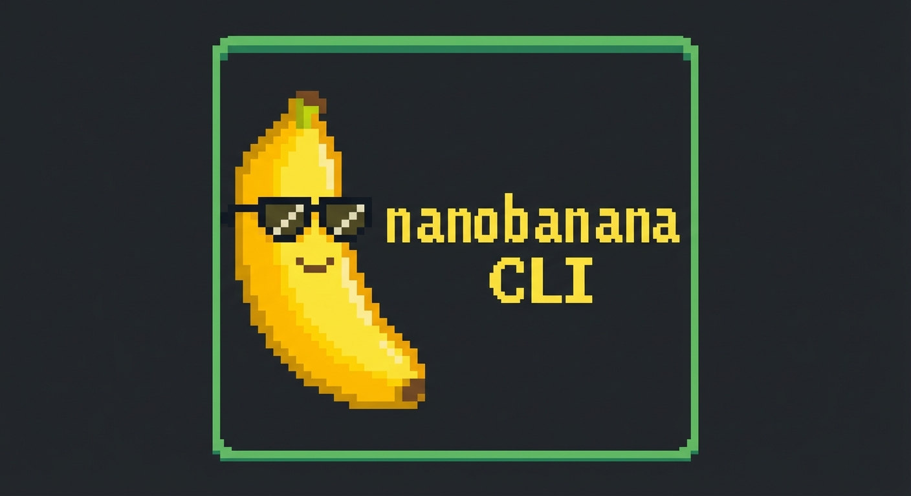

<p align="center">
  
</p>

<h1 align="center">nanobanana</h1>

<p align="center">
  Gemini image generation from the command line. Single binary, no dependencies.
</p>

## Installation

```bash
# macOS (Apple Silicon)
curl -L https://github.com/Factory-AI/nanobanana-cli/releases/latest/download/nanobanana-darwin-arm64 -o nanobanana
chmod +x nanobanana

# macOS (Intel)
curl -L https://github.com/Factory-AI/nanobanana-cli/releases/latest/download/nanobanana-darwin-x64 -o nanobanana
chmod +x nanobanana

# Linux (x64)
curl -L https://github.com/Factory-AI/nanobanana-cli/releases/latest/download/nanobanana-linux-x64 -o nanobanana
chmod +x nanobanana
```

```powershell
# Windows (PowerShell)
Invoke-WebRequest -Uri "https://github.com/Factory-AI/nanobanana-cli/releases/latest/download/nanobanana-windows-x64.exe" -OutFile "nanobanana.exe"
```

Then set your API key:

```bash
# macOS/Linux
export GEMINI_API_KEY="your-api-key"
```

```powershell
# Windows (PowerShell)
$env:GEMINI_API_KEY="your-api-key"
```

Get an API key at https://aistudio.google.com/apikey

## Usage

```bash
# Generate images
nanobanana generate "sunset over mountains"
nanobanana generate "logo" --count=4 --styles=modern,minimal --preview

# Edit existing images
nanobanana edit photo.png "add sunglasses"

# Restore old photos
nanobanana restore old_photo.jpg "remove scratches"

# Generate icons
nanobanana icon "settings gear" --sizes=64,128,256 --style=minimal

# Create patterns
nanobanana pattern "hexagons" --style=geometric --colors=duotone

# Generate diagrams
nanobanana diagram "login flow" --type=flowchart

# Create image sequences
nanobanana story "seed growing into tree" --steps=5 --type=process
```

## Commands

| Command | Description |
|---------|-------------|
| `generate <prompt>` | Generate images from text |
| `edit <file> <prompt>` | Modify an existing image |
| `restore <file> [prompt]` | Restore old/damaged photos |
| `icon <prompt>` | Generate app icons |
| `pattern <prompt>` | Create seamless patterns |
| `diagram <prompt>` | Generate technical diagrams |
| `story <prompt>` | Create image sequences |
| `tips [command]` | Show prompting tips |

## Options

```
--count=N       Number of variations (1-8)
--styles=a,b    Comma-separated styles
--preview, -p   Open images after generation
--type=TYPE     Type for icons/patterns/diagrams
--steps=N       Steps for stories (2-8)
```

Run `nanobanana tips <command>` for detailed options and examples.

## Output

Images are saved to `./nanobanana-output/` in the current directory.

## Development

Build from source (requires [Bun](https://bun.sh)):

```bash
# Install dependencies
bun install

# Run directly
bun run cli.ts generate "a cat"

# Build for current platform
bun build cli.ts --compile --outfile nanobanana

# Cross-compile
bun build cli.ts --compile --target=bun-linux-x64 --outfile nanobanana-linux
bun build cli.ts --compile --target=bun-darwin-arm64 --outfile nanobanana-darwin-arm64
bun build cli.ts --compile --target=bun-windows-x64 --outfile nanobanana.exe
```

## Releasing

To create a new release:

1. Bump the version in `package.json`
2. Create and push a tag: `git tag v1.x.x && git push --tags`
3. GitHub Actions will build binaries for all platforms and create the release
